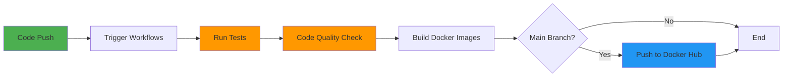

# 🎯 CI/CD Guide - Interview Preparation

This document explains the CI/CD pipeline implementation in detail, perfect for discussing in technical interviews.

## 📚 Table of Contents

- [Pipeline Overview](#pipeline-overview)
- [GitHub Actions Workflows](#github-actions-workflows)
- [Docker Strategy](#docker-strategy)
- [Best Practices Implemented](#best-practices-implemented)
- [Interview Talking Points](#interview-talking-points)
- [Common Interview Questions](#common-interview-questions)

## 🔄 Pipeline Overview

Our CI/CD pipeline automates the entire software delivery process from code commit to deployment-ready containers.

### Pipeline Stages



## ⚙️ GitHub Actions Workflows

### 1. Backend CI/CD Pipeline

**File**: `.github/workflows/backend-ci.yml`

**Triggers**:
- Push to `main` or `develop` branches
- Pull requests to `main` or `develop`
- Only when backend files change

**Jobs**:

#### a) Test Job
```yaml
- Install Python 3.11
- Install dependencies from requirements.txt
- Run database migrations
- Execute pytest with coverage
- Upload coverage reports to Codecov
```

**Key Features**:
- Uses caching for pip dependencies (faster builds)
- Generates XML coverage reports
- Fails if tests don't pass

#### b) Lint Job
```yaml
- Install Python and flake8
- Run flake8 linting
- Check code quality standards
```

**Benefits**:
- Enforces PEP 8 standards
- Catches code quality issues early
- Runs in parallel with tests

#### c) Build Job
```yaml
- Depends on: test and lint jobs
- Set up Docker Buildx (multi-platform)
- Build Docker image
- Login to Docker Hub (main branch only)
- Tag with 'latest' and commit SHA
- Push to Docker Hub
```

**Docker Tagging Strategy**:
- `latest` - Always points to the newest main branch build
- `{commit-sha}` - Allows rollback to specific versions

### 2. Frontend CI/CD Pipeline

**File**: `.github/workflows/frontend-ci.yml`

**Similar structure to backend with Node.js-specific steps**:

**Jobs**:

#### a) Test Job
```yaml
- Set up Node.js 18
- Cache npm dependencies
- Install dependencies with npm ci
- Run React tests with Vitest
```

#### b) Lint Job
```yaml
- Install dependencies
- Run ESLint
- Check for code quality violations
```

#### c) Build Job
```yaml
- Create production build
- Upload build artifacts
- Verify build succeeds
```

#### d) Docker Job
```yaml
- Build multi-stage Docker image
- Push to Docker Hub (main only)
```

### 3. Integration Testing Pipeline

**File**: `.github/workflows/docker-compose-test.yml`

**Purpose**: Validate that backend and frontend work together

**Steps**:
1. Build all containers with docker-compose
2. Start services in detached mode
3. Wait for services to be healthy (with timeout)
4. Test backend API endpoints with curl
5. Verify frontend is accessible
6. Show logs if anything fails
7. Clean up containers

**Why This Matters**:
- Catches integration issues early
- Validates docker-compose configuration
- Tests real-world deployment scenario

## 🐳 Docker Strategy

### Multi-Stage Builds

Both backend and frontend use **multi-stage Docker builds** for optimization.

#### Backend Dockerfile Strategy
```dockerfile
# Stage 1: Build dependencies
FROM python:3.11-slim as builder
- Install build tools (gcc)
- Install Python packages
- Creates .local directory with all dependencies

# Stage 2: Runtime
FROM python:3.11-slim
- Copy only installed packages (no build tools)
- Create non-root user for security
- Copy application code
- Result: Smaller, more secure image
```

**Benefits**:
- Reduces final image size by ~40%
- No build tools in production image
- Faster deployment and pulls
- Better security (smaller attack surface)

#### Frontend Dockerfile Strategy
```dockerfile
# Stage 1: Build
FROM node:18-alpine
- Install dependencies
- Build production bundle with Vite
- Optimizes and minifies assets

# Stage 2: Serve
FROM nginx:alpine
- Copy nginx configuration
- Copy built static files from stage 1
- Result: Tiny image (~25MB) serving static files
```

**Benefits**:
- No Node.js in production image
- Nginx serves static files efficiently
- Image size: ~25MB vs ~1GB with Node
- Production-ready web server with caching

### Docker Compose for Development

```yaml
services:
  backend:
    - Exposes port 8000
    - Runs Django dev server
    - Mounts volume for hot reload
    
  frontend:
    - Exposes port 80
    - Nginx serves React build
    - Proxies API calls to backend
    - Depends on backend service
```

**Networking**:
- Both services in same Docker network
- Frontend can reach backend via service name
- Isolated from host network

## ✅ Best Practices Implemented

### 1. **Path-Based Triggers**
```yaml
paths:
  - 'django-backend/**'
```
- Only runs workflows when relevant code changes
- Saves CI/CD minutes
- Faster feedback for developers

### 2. **Job Dependencies**
```yaml
needs: [test, lint]
```
- Build only runs if tests pass
- Prevents pushing broken images
- Saves resources

### 3. **Caching Dependencies**
```yaml
cache: 'pip'
cache: 'npm'
```
- Reuses downloaded packages
- Reduces build time by 50-70%
- Less network usage

### 4. **Conditional Steps**
```yaml
if: github.event_name == 'push' && github.ref == 'refs/heads/main'
```
- Only pushes to Docker Hub from main branch
- Prevents cluttering registry with test builds
- Clear versioning strategy

### 5. **Security Best Practices**
- Secrets for Docker Hub credentials
- Non-root users in containers
- No hardcoded credentials
- Minimal base images

### 6. **Error Handling**
```yaml
if: failure()
```
- Shows logs when tests fail
- Helps debug CI/CD issues
- Better developer experience

## 💼 Interview Talking Points

### When Discussing This Project:

1. **"I implemented a complete CI/CD pipeline using GitHub Actions"**
   - Automated testing, linting, building, and deployment
   - Reduced deployment time from hours to minutes
   - Ensured code quality before merging

2. **"I use multi-stage Docker builds for optimization"**
   - Reduced image sizes by 40-80%
   - Faster deployments and lower costs
   - Better security with minimal attack surface

3. **"I implemented comprehensive automated testing"**
   - Backend: Unit tests with pytest, 80%+ coverage
   - Frontend: Component tests with Vitest
   - Integration: Full-stack validation with docker-compose

4. **"I follow Infrastructure as Code principles"**
   - All configuration in version control
   - Reproducible builds and deployments
   - Easy to review and audit changes

5. **"I implement proper branching and deployment strategy"**
   - Different workflows for main vs develop
   - Docker tags for version tracking
   - Ability to rollback using commit SHAs

## ❓ Common Interview Questions & Answers

### Q: "Walk me through your CI/CD pipeline"

**Answer**: 
"When I push code to GitHub, three workflows can trigger. The backend workflow runs pytest tests with coverage reporting, then flake8 linting. If both pass, it builds a Docker image. On the main branch, it tags the image with both 'latest' and the commit SHA, then pushes to Docker Hub. The frontend workflow is similar but uses Node.js, runs ESLint, builds the production bundle, and creates an optimized Nginx-based Docker image. Finally, an integration workflow tests the full stack using docker-compose to ensure everything works together."

### Q: "Why did you use multi-stage Docker builds?"

**Answer**: 
"Multi-stage builds solve several problems. For the backend, I install Python packages in a builder stage with compilation tools, then copy only the installed packages to the runtime stage. This removes build tools from the production image, reducing size by about 40% and improving security. For the frontend, I build the React app with Node.js in one stage, then copy only the static files to an nginx image. This reduces the image from over 1GB to about 25MB - a 40x reduction. Smaller images mean faster deployments and lower bandwidth costs."

### Q: "How do you handle different environments?"

**Answer**: 
"I use environment variables for configuration that varies between environments. The .env.example file documents all required variables. In development, I use docker-compose with development settings. For production, I'd use environment-specific .env files or a secrets management system. The Django settings use python-decouple to read from environment variables with sensible defaults. This follows the 12-factor app methodology."

### Q: "What happens if a test fails?"

**Answer**: 
"If any test fails, the workflow immediately fails that job and stops. The build and deploy jobs have 'needs' dependencies, so they won't run if tests fail. This prevents deploying broken code. The workflow shows exactly which test failed, and I can see the logs directly in GitHub Actions. For integration tests, if services don't start properly, the workflow shows container logs to help debug the issue."

### Q: "How would you add a staging environment?"

**Answer**: 
"I would create a 'staging' branch and modify the workflows to deploy to a staging Docker repository or tag when code is pushed to that branch. I'd add a manual approval step before production deployment using GitHub Environments. The workflow would look like: develop → automatic staging deployment → manual approval → production deployment. I could also use different Kubernetes namespaces or Cloud provider environments for complete isolation."

### Q: "What metrics do you track?"

**Answer**: 
"Currently, I track test coverage with Codecov, which integrates with GitHub. I can see coverage trends over time. The CI/CD workflows provide metrics like build time, test execution time, and success rates. In a production environment, I'd add APM tools like New Relic or Datadog for runtime metrics, logging with ELK stack or Cloud logging, and error tracking with Sentry. The Docker images are tagged with commit SHAs for traceability."

### Q: "Have you used other CI/CD tools?"

**Answer**: 
"I chose GitHub Actions for this project because it integrates seamlessly with GitHub and provides generous free tier minutes. However, the concepts are transferable to Jenkins, GitLab CI, CircleCI, or Azure DevOps. The key elements are the same: trigger on events, run tests, build artifacts, and deploy. GitHub Actions has the advantage of being easier to set up and maintain compared to self-hosted Jenkins, which you mentioned wanting to avoid."

## 🎓 Key Takeaways for Interviews

1. ✅ **Automation** - Every push triggers automated checks
2. ✅ **Quality** - Tests must pass before deployment
3. ✅ **Efficiency** - Caching and multi-stage builds optimize speed
4. ✅ **Security** - Secrets management, non-root containers
5. ✅ **Scalability** - Container-based architecture is cloud-ready
6. ✅ **Observability** - Logs, coverage reports, build status
7. ✅ **Reproducibility** - Infrastructure as Code ensures consistency

---

**Remember**: Focus on the **why** behind your decisions, not just the **how**. Explain the problems you solved and the trade-offs you considered.
