# 🚀 Task Manager - Full-Stack CI/CD Portfolio Project


A production-ready full-stack Task Management application demonstrating modern CI/CD practices with **Django REST Framework**, **React**, **Docker**, and **GitHub Actions**.

## 📋 Table of Contents

- [Overview](#overview)
- [Features](#features)
- [Tech Stack](#tech-stack)
- [Architecture](#architecture)
- [Quick Start](#quick-start)
- [CI/CD Pipeline](#cicd-pipeline)
- [Documentation](#documentation)
- [License](#license)

## 🎯 Overview

This project showcases a complete DevOps workflow suitable for demonstrating **2+ years of experience** in modern software development practices. It includes:

- ✅ Full-stack application with RESTful API
- ✅ Comprehensive automated testing
- ✅ Multi-stage Docker builds for optimization
- ✅ GitHub Actions CI/CD pipelines
- ✅ Container orchestration with Docker Compose
- ✅ Code quality and linting automation
- ✅ Production-ready deployment configuration

## ✨ Features

### Application Features
- 📝 Create, read, update, and delete tasks
- ⚡ Real-time task status updates
- 🎨 Modern, responsive UI with dark theme
- 🏷️ Task prioritization (Low, Medium, High)
- 📊 Task statistics dashboard
- 🔍 Filter tasks by status (All, Pending, Completed)

### DevOps Features
- 🔄 Automated testing on every push/PR
- 🐳 Containerized development and deployment
- 🚀 Automated Docker image builds and publishing
- 📈 Code coverage tracking
- ✅ Linting and code quality checks
- 🔧 Environment-based configuration

## 🛠️ Tech Stack

### Backend
- **Django 4.2** - Python web framework
- **Django REST Framework** - API development
- **pytest** - Testing framework
- **PostgreSQL 15** - Production database
- **flake8** - Code linting

### Frontend
- **React 18** - UI library
- **Vite** - Build tool
- **Axios** - HTTP client
- **Modern CSS** - Styling with gradients and animations

### DevOps
- **Docker** - Containerization
- **Docker Compose** - Multi-container orchestration
- **GitHub Actions** - CI/CD automation
- **Nginx** - Production web server

## 🏗️ Architecture



```mermaid
graph TB
    subgraph "Frontend"
        React[React App<br/>Vite + Modern UI]
        Nginx[Nginx Server<br/>Port 80]
    end
    
    subgraph "Backend"
        Django[Django REST API<br/>Port 8000]
        DB[(SQLite Database)]
    end
    
    subgraph "CI/CD Pipeline"
        GHA[GitHub Actions]
        Tests[Automated Tests]
        Docker[Docker Build & Push]
    end
    
    React --> Nginx
    Nginx --> Django
    Django --> DB
    GHA --> Tests
    Tests --> Docker
    Docker --> DockerHub[Docker Hub Registry]
    
    style React fill:#61dafb
    style Django fill:#092e20
    style GHA fill:#2088ff
    style Docker fill:#2496ed
```

## 🚀 Quick Start

### Prerequisites
- **Docker** and **Docker Compose** installed
- **Git** for version control
- (Optional) **Node.js 18+** and **Python 3.11+** for local development

### Using Docker Compose (Recommended)

1. **Clone the repository**
   ```bash
   git clone https://github.com/YOUR_USERNAME/YOUR_REPO.git
   cd YOUR_REPO
   ```

2. **Create environment file**
   ```bash
   copy .env.example .env
   ```

3. **Start the application**
   ```bash
   docker-compose up --build
   ```

4. **Access the application**
   - **Frontend**: http://localhost
   - **Backend API**: http://localhost:8000/api/tasks/
   - **Admin Panel**: http://localhost:8000/admin/

### Local Development Setup (Without Docker)

For detailed instructions on running backend and frontend locally on your machine:

**See [LOCAL_DEVELOPMENT.md](LOCAL_DEVELOPMENT.md)** - Complete guide with:
- Python/Node.js installation
- Backend setup with Django
- Frontend setup with React
- Testing and linting
- **Step-by-step GitHub push instructions**
- Troubleshooting guide

## 🔄 CI/CD Pipeline

This project implements a comprehensive CI/CD pipeline with three GitHub Actions workflows:

### Backend Pipeline
- ✅ Python dependency installation
- ✅ Database migrations
- ✅ Automated testing with pytest
- ✅ Code coverage reporting
- ✅ flake8 linting
- ✅ Docker image build
- ✅ Push to Docker Hub (on main branch)

### Frontend Pipeline
- ✅ Node.js dependency installation
- ✅ React component testing
- ✅ ESLint code quality checks
- ✅ Production build creation
- ✅ Docker image build
- ✅ Push to Docker Hub (on main branch)

### Integration Testing
- ✅ Full-stack docker-compose validation
- ✅ API endpoint testing
- ✅ Service health checks

**See [CICD_GUIDE.md](CICD_GUIDE.md) for detailed pipeline explanation and interview talking points.**

## 📚 Documentation

- **[README.md](README.md)** - Project overview and quick start
- **[LOCAL_DEVELOPMENT.md](LOCAL_DEVELOPMENT.md)** - **Detailed local setup without Docker + GitHub push guide**
- **[QUICKSTART.md](QUICKSTART.md)** - Fast Docker setup with PostgreSQL
- **[SETUP.md](SETUP.md)** - Complete setup guide with troubleshooting
- **[CICD_GUIDE.md](CICD_GUIDE.md)** - CI/CD pipeline explanation for interviews
- **[docs/ARCHITECTURE.md](docs/ARCHITECTURE.md)** - System architecture and design decisions

## 🔧 Configuration

### GitHub Secrets Required

To enable Docker Hub publishing, add these secrets to your GitHub repository:

1. Go to **Settings → Secrets and variables → Actions**
2. Add the following secrets:
   - `DOCKER_USERNAME` - Your Docker Hub username
   - `DOCKER_PASSWORD` - Your Docker Hub access token

See [SETUP.md](SETUP.md) for detailed configuration instructions.

## 📊 Project Structure

```
├── django-backend/          # Django REST API
│   ├── core/               # Project settings
│   ├── tasks/              # Tasks app
│   │   ├── tests/          # Unit tests
│   │   ├── models.py       # Data models
│   │   ├── serializers.py  # API serializers
│   │   └── views.py        # API endpoints
│   ├── Dockerfile          # Backend container
│   └── requirements.txt    # Python dependencies
│
├── react-frontend/         # React application
│   ├── src/
│   │   ├── components/     # React components
│   │   ├── services/       # API integration
│   │   └── App.jsx         # Main app
│   ├── Dockerfile          # Frontend container
│   ├── nginx.conf          # Production server config
│   └── package.json        # Node dependencies
│
├── .github/workflows/      # CI/CD pipelines
│   ├── backend-ci.yml      # Backend workflow
│   ├── frontend-ci.yml     # Frontend workflow
│   └── docker-compose-test.yml
│
├── docker-compose.yml      # Container orchestration
└── README.md              # This file
```

## 🧪 Running Tests

### Backend Tests
```bash
cd django-backend
pip install -r requirements.txt
pytest --cov
```

### Frontend Tests
```bash
cd react-frontend
npm install
npm test
```

## 📝 API Endpoints

### Tasks API
- `GET /api/tasks/` - List all tasks
- `POST /api/tasks/` - Create new task
- `GET /api/tasks/{id}/` - Retrieve task details
- `PATCH /api/tasks/{id}/` - Update task
- `DELETE /api/tasks/{id}/` - Delete task
- `GET /api/tasks/completed/` - Get completed tasks
- `GET /api/tasks/pending/` - Get pending tasks
- `POST /api/tasks/{id}/toggle_complete/` - Toggle completion status

## 🎓 For Job Interviews

This project demonstrates expertise in:

1. **Full-Stack Development** - Django + React integration
2. **DevOps Practices** - Docker, CI/CD, containerization
3. **Testing** - Unit tests, integration tests, code coverage
4. **Code Quality** - Linting, formatting, best practices
5. **Modern UI/UX** - Responsive design, animations, accessibility
6. **API Design** - RESTful APIs, serialization, validation
7. **Version Control** - Git workflows, branching strategies

**Key talking points for interviews** are documented in [CICD_GUIDE.md](CICD_GUIDE.md).

## 🤝 Contributing

This is a portfolio project, but suggestions and improvements are welcome!

## 📄 License

This project is open source and available under the MIT License.

---

**Built with ❤️ to showcase modern DevOps and full-stack development skills**

*Perfect for demonstrating 2+ years of experience in job interviews!*
